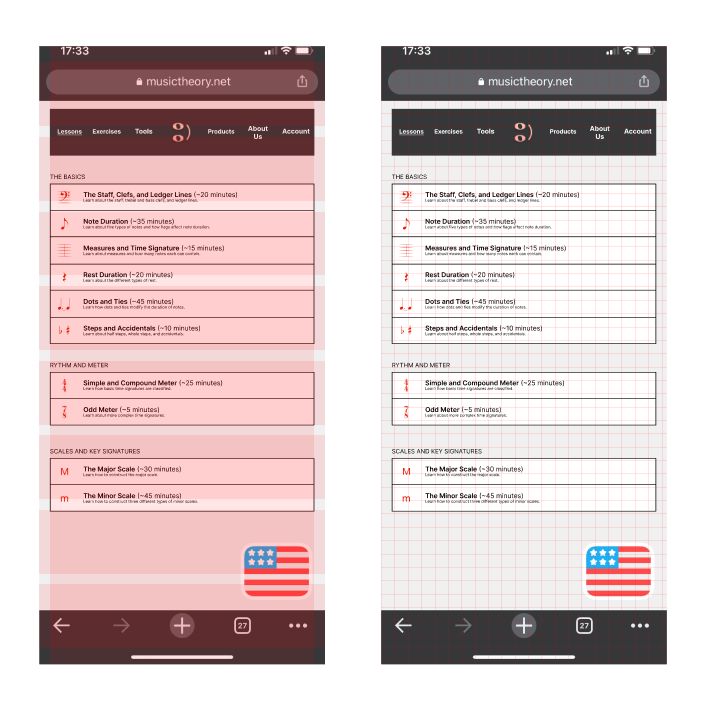
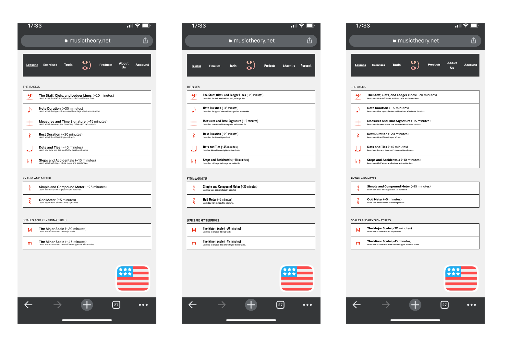
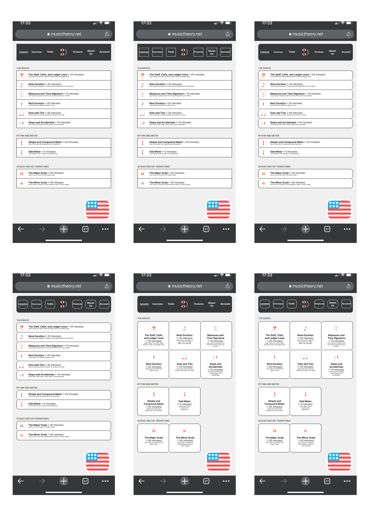

# ASSIGNMENT06-CHRIS-HUNT-DH110

## Interface Design

### Introduction

The purpose of this project is to redesign musictheory.net to provide a better user experience to anyone who will use the website. To achieve this I will talk to users who fit the demographics as well as others who are interested in such an application that they can provide feedback that will help push along the design to create a better experience.

Interface Design allows Designer/Researcher to put up higher fidelity prototypes with the feedback they gathered from prior tests. That way you can make sure you're on the right track. Testing different Interface Design helps identify what the original website was doing well along with what the Designer/Researcher can change.

### URLs
[Wireflow](https://www.figma.com/file/QOXXEFvprdodF0daWYRbqX/Interface-Design-System?node-id=19%3A704)

[5 second usability test](https://youtu.be/gVTsw0LuuA4)

>Summary of findings from 5 second usability test:
>
>   Logo and flag are the first things to stick out. "There's a little happy face on the top (referring to the logo), Flag in the corner (referring to the USA flag in the bottom right." So right away the user is able to identify the logo of the website along with the language in which they are reading the website. After reviewing the footage I should have asked what does the user think clicking those items will do to see if they're able to understand what each one does or if there's something I can do on my end that can make it more clear for them.

[More in depth Interface Design test](https://youtu.be/lCJRRiDlMzo)

>Summary of findings from more in depth Interface Design test:
>
>   "The one on the left is the easiest one to read, the other two the fonts, the middle one the fonts are too close to each other it's hard to make out the letters. The last one's fonts looked like they're squeezed; they're flattened out like somebody put them in a vice and flattened them they look like they're pixley. First one is the most easiest to read out of all the three."
>   Inter (the text being used in the most left image) is the easiest to read. 
>   
>   "This one right here is the easiest one to read and understand(points at the screen at the bottom right one on the shapes.png file)"
>   We also learn that the bottom right design in the shape layout was the easiest to read and understand. White boarder makes it easier to read because its consistent.
>   
>   "The red kind of fades into the black."
>   For the dark mode of the website I should look into different colors to use for the image of the lesson instead of red because it seems to fade into the black making it harder for user to see it. The user currently would rather prefer to use the light mode and dim their screen at night.

[Test Screens Figma](https://www.figma.com/file/QOXXEFvprdodF0daWYRbqX/Interface-Design-System?node-id=0%3A1)

### Chosen Wireframe

### Screen Design

##### Layout Design

##### Typographic Variations

##### Shape Variations

##### Color Scheme (Light and Dark mode)

### Color Contrast Accessibility (Spark plugin screenshot)

### Summary of Graphic Design

#### Adobe Color Theme

##### Typeface family and size:

>Header: Inter Bold 9
>
>Lesson group: Inter Regular 9
>
>Lesson title: Inter Semi Bold 10
>
>Estimated time: Inter Regular 10
>
>Lesson description: Inter Regular 6

How I made the decision?

I chose Inter because after viewing many different fonts on fonts.google and seeing someone talk about fonts on LinkedIn. I needed something that was simple and easy for everyone to read. Inter really captures my goals in that sense because I want anyone to be able to open the website and start learning music theory. To make it even more inclusive I could possibly add a different font size option. E.g. small, medium, large. and have the fonts the size that it would appear on the screen so it would make more sense to people. Also having a landscape mode for mobile where the UI fills out the space better but would also mean I need to have a landscape version built out.

##### Color scheme:

>Background color: F0F0F0
>
>Header color: 353739
>
>Text color: FFFFFF/000000

How I made the decision?

I wanted to stay with neutral colors in a sense because I personally found it hard to incorporate the Adobe Color Theme into the website while keeping a clean and easy on the eye look to it. There are multiple logos for the website ranging from a black and white to the pinkish one I chose to use so in a sense I did stay with the Adobe Color Theme if I used the black and white logo but I felt like the pinkish tone was a nice refreshing color on the black and would pop more. Black on white is a very boring color scheme but it has stood the test of time and is used universally because we know it works. I don't think this music theory site needs any significant color aside from the logo, some highlighted stuff in lessons, and the flags letting you know what language you are learning in and I found that to be the case after testing a multitude of color combinations.

##### Layout grid and spacing:

>20px grid
>
>1 column 16 margin 16 gutter
>
>8 rows 24 margin 16 gutter
>
>(alternate spacing used)
>
>3 column 0 margin 0 gutter
>
>2 rows 0 margin 0 gutter

How I made the decision?

The 20px grid was a good size when I was testing out the different grid sizes. It helped me place items in a uniform manner and keep the same formatting throughout the design. It also provided me with a general guideline for how big I can make an item I wanted to place because I knew if I need to fit 8 items here and I only have 7 grids then I would have to make them smaller than that to fit equally. The column and rows proved to be very useful too making sure I have enough space between the edge of my design and the edge of the phone screen in this case because having stuff right up against the edge isn't that easy for users to access especially if it's a smaller item. It also helped me center my design and space things out equally without having to draw rectangles and format everything inside of them. Another way I used rows and columns is to make my 5th and 6th design for the shape design making 3 columns and 2 rows so I can equally space out my 6 lessons that were prior vertically organized into a grid/chart without drawing out a chart.
